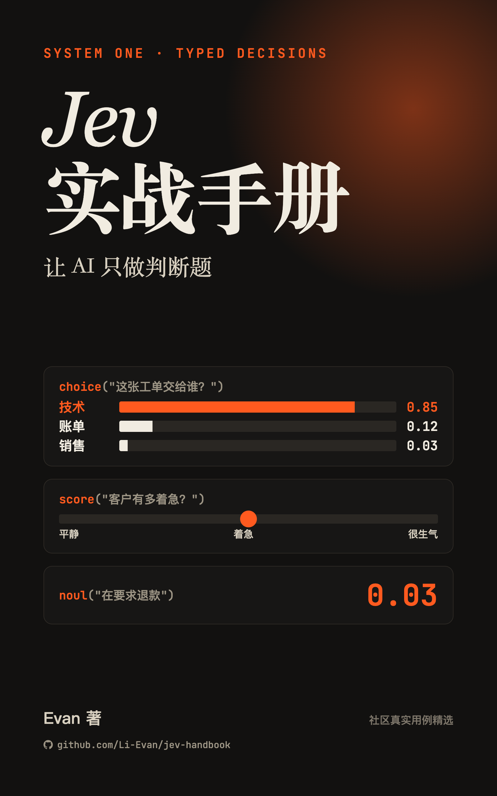

# Jev 实战手册



**让 AI 只做判断题。** 从社区三千多个真实项目里挑出最值得学的用法，按场景讲清楚 Jev 能做什么、怎么做、效果如何、哪里会翻车。

Jev 是 TypeSafe 在 2026 年 9 月发布的 System One 模型：它不写文字，只回答带类型的问题，并给出校准过的概率。这本书讲的是怎么把它用进真实的产品和业务里。

全书 17 章加一个附录，近 9 万个汉字，初版已经写完。书稿开源，每次更新都会自动生成新的电子书。

- 在线阅读：<https://li-evan.github.io/jev-handbook/>
- 下载 EPUB：<https://li-evan.github.io/jev-handbook/jev-handbook.epub>
- 全部案例的来源库：[awesome-jev](https://li-evan.github.io/awesome-jev/?lang=zh)

## 导入微信读书

1. 在电脑上下载 EPUB 文件。
2. 打开 [微信读书网页版](https://weread.qq.com/)，用微信扫码登录，点右上角的「传书到手机」，选中下载的 EPUB。
3. 回到手机上的微信读书，在书架里就能看到这本书。

导入的书只在你自己的书架里，别人看不到。按微信读书目前的规则，非付费会员每月可以导入 3 本，付费会员不限。

## 目录

**第一部分 认识 Jev**

1. Jev：一个只做判断题的模型
2. 三种问法：Choice、Score、Noul
3. 半小时跑通第一个请求

**第二部分 按场景看用法**

4. 金融与交易：判断交给 Jev，下单留给代码
5. 编程 agent：大模型写代码，Jev 把关
6. 浏览器与电脑操控：把屏幕变成一张带编号的菜单
7. Agent 编排与路由：Jev 只守岔路口
8. 搜索与 RAG：召回交给检索，判断交给 Jev
9. 安全与审核：护栏只是一路信号
10. 数据与评测：先拿人工标注量一量，再全量跑
11. 客服与销售：先分拣，再动笔
12. 电商、营销与内容：从抽查到全量
13. 实时交互：Jev 只坐在控制回路最慢的那一层
14. 个人效率与更多行业：判断很小，次数很多

**第三部分 用好 Jev**

15. 六个反复出现的设计模式：问题拆小，决定留给代码
16. 它不擅长什么：多数短板绕得开，少数只能换工具
17. 开源复刻与替代：接口好抄，校准难抄

附录 A 资源导航

每章选了哪些案例、为什么选，见 [OUTLINE.md](OUTLINE.md)。

## 自己生成电子书

```bash
brew install pandoc epubcheck
uv run tools/build.py
```

生成的文件在 `dist/` 目录：`jev-handbook.epub` 和在线阅读版 `site/index.html`。加上 `--pdf` 参数还会生成 PDF，需要本机装有 xelatex。

正文在 `book/` 目录，一章一个 Markdown 文件，按文件名前的数字排序。

书里的配图都是自己画的：源文件是 `assets/figures/src/` 下的 HTML，用 `uv run tools/figures.py` 调本机的 Chrome 渲染成 PNG，改完图要重新渲染再构建。

## 参与

发现事实错误、链接失效，或者想推荐一个值得写进书里的案例，欢迎提 issue。

## 说明

本书由社区作者编写，与 TypeSafe 官方无关。Jev 的价格、限额和能力以 [官方文档](https://docs.typesafe.ai) 为准。

书稿以 [CC BY-NC-SA 4.0](LICENSE) 许可发布：可以自由转载和改编，但需要署名、不能用于商业用途，改编后的作品也要用同样的许可发布。书中的案例截图和视频画面来自各案例的作者，版权归原作者所有，不在这个许可范围内，图注里注明了出处。
